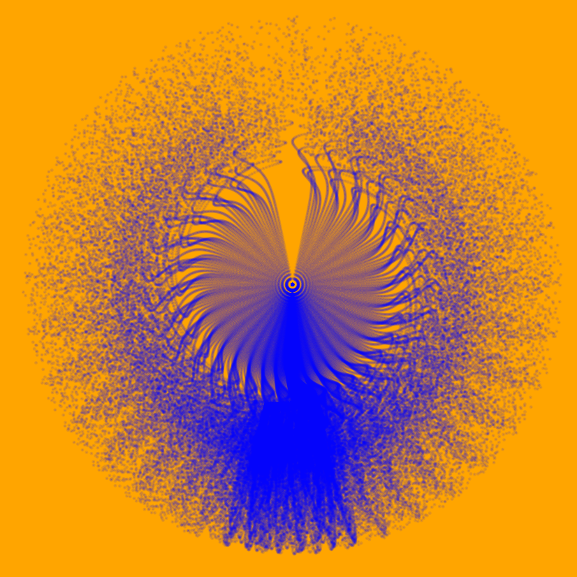
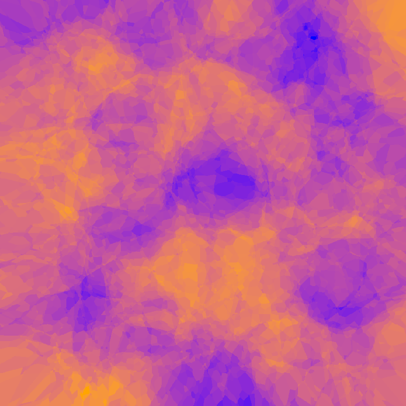
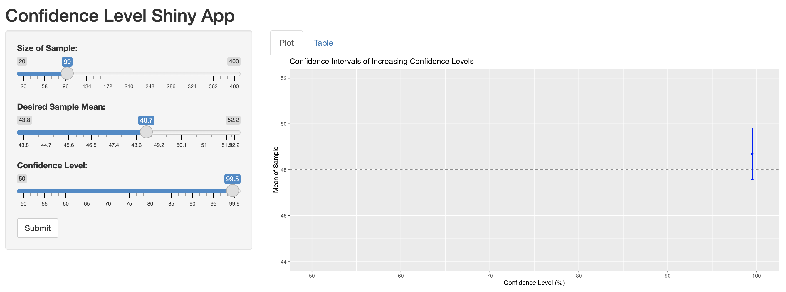

This page showcases some of the visualizations I have made this semester. I start off by showing three generative art pieces created in R Studio. They are entitled "EGG", "BIRD", and "DUSTER". These dramatic pieces tell fascinating stories about our society, its complex nature, and our place within it.

"EGG"

```{r, echo=FALSE}

```

"BIRD"

```{r, echo=FALSE}

```


"DUSTER"

```{r, echo=FALSE}

```

```{r setup, include=FALSE}
knitr::opts_chunk$set(echo = FALSE)
```

```{r}
library(ggplot2)
library(Lock5Data)
data(StudentSurvey)
```


The first visualization comes from a student survey data set. Students were asked how much exercise they got per week in hours. I created a histogram to show how this data was spread, and filled the bars with a color coorespinding to the number of responses in each bin. 


```{r,warning=FALSE}
ggplot(StudentSurvey,aes(x=Exercise, y= ..density..))+
  geom_histogram(binwidth=2,aes(fill=..count..))+
  geom_density()+
  xlab("Exercize Hours per Week")+
  ylab("Density")+
  ggtitle("Excercize Hours Histogram")
#univariate ggplot
```


The next visualization comes from the same data set. Students were asked their GPA and which award they would want to receive most: Nobel, Olympic, or Academy. The results are shown as violin plots colored and separated according to which award the students would want the most. This shows the spread of GPAs relative to the different answers. 


```{r, warning=FALSE}
ggplot(StudentSurvey,aes(x=Award,y=GPA,fill=Award))+
  geom_violin(scale="width",alpha=0.5,)+
  guides(fill="none")+
  geom_boxplot(width=0.25)
```


Our next visualization focuses on the exercise in hours per week and pulses of the students.This hexplot shows where the students fall with both these categories and some correlation of the two variables.


```{r, echo=FALSE}

```
The next visualization is an app my group mates and I created using Shiny. It is designed to teach students the concept of confidence levels and intervals by allowing them to interact with our graphics. We show that as confidence level rises, so does the size of the bar that could include the true mean. If the true mean is included in the confidence interval, it turns blue. Otherwise, it is orange. This helps students build intuition on this subject by interacting with the app instead of just reading something like a textbook. A still of our app is shown below, and the link is here: https://rconnect.bucknell.edu/content/4bc055a7-8c0e-4988-83e7-a657ace9fb16

```{r, echo=FALSE}

```

