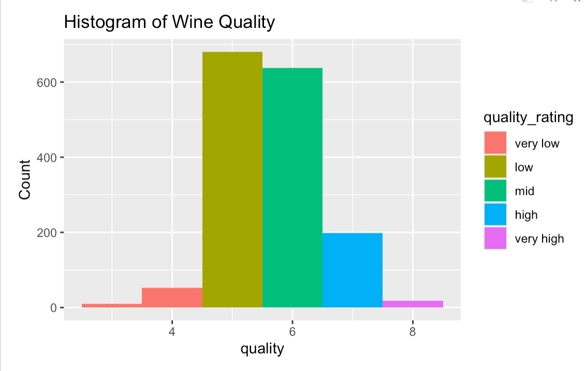
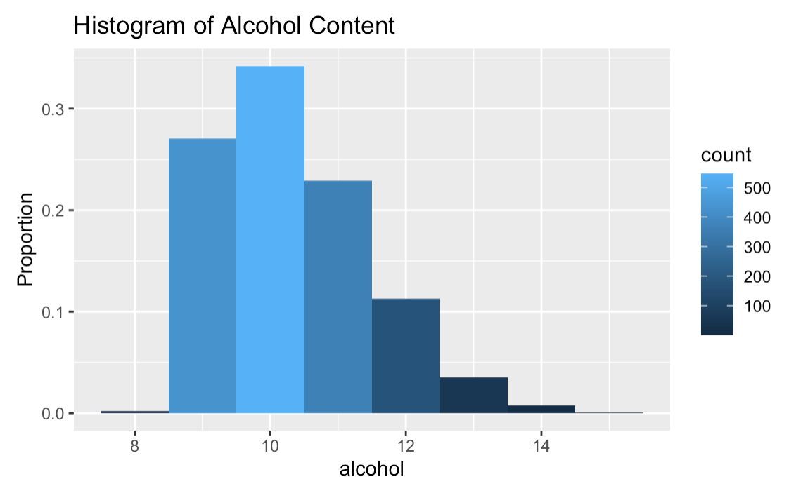
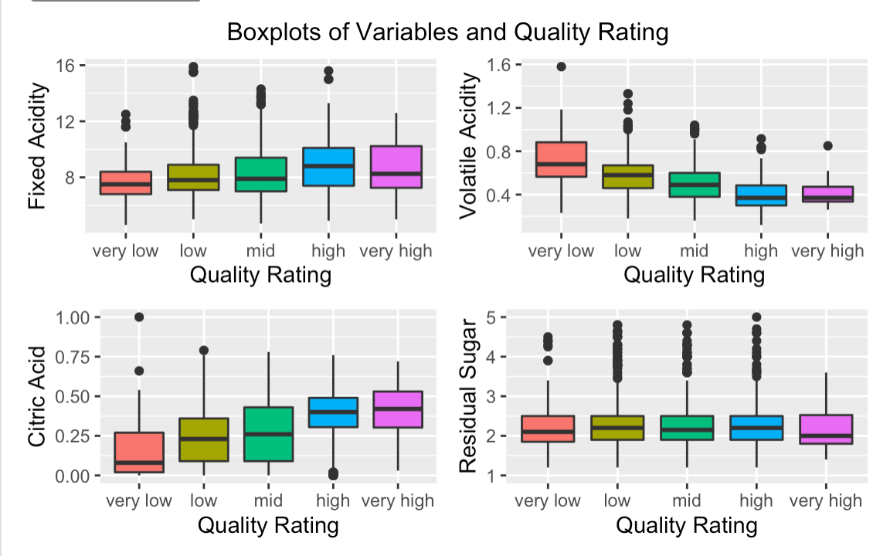
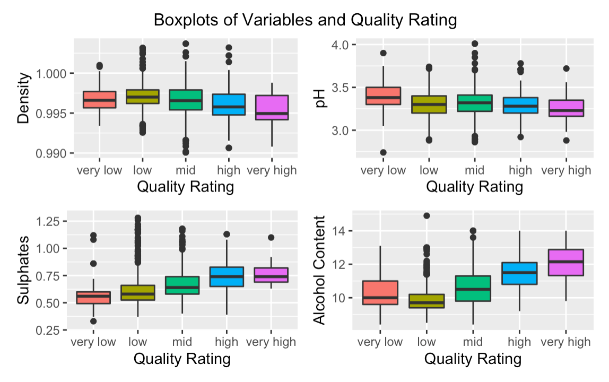
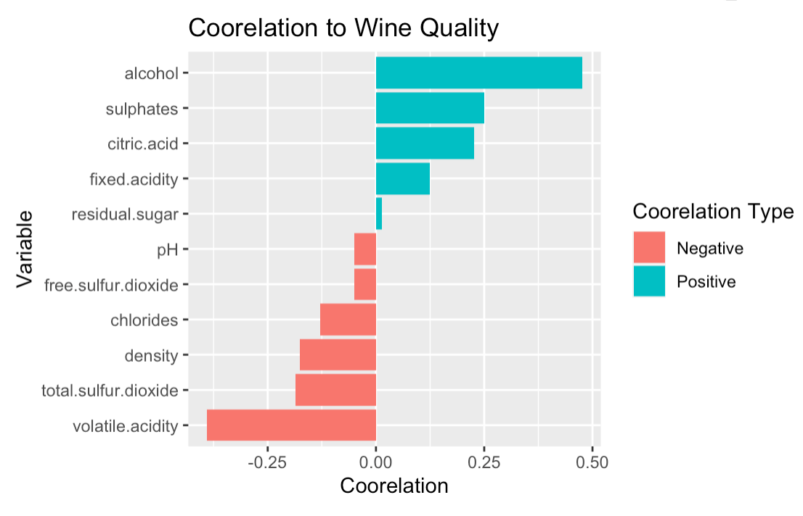
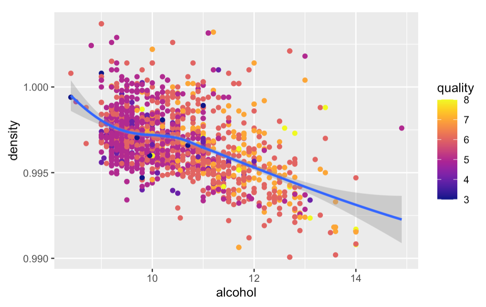
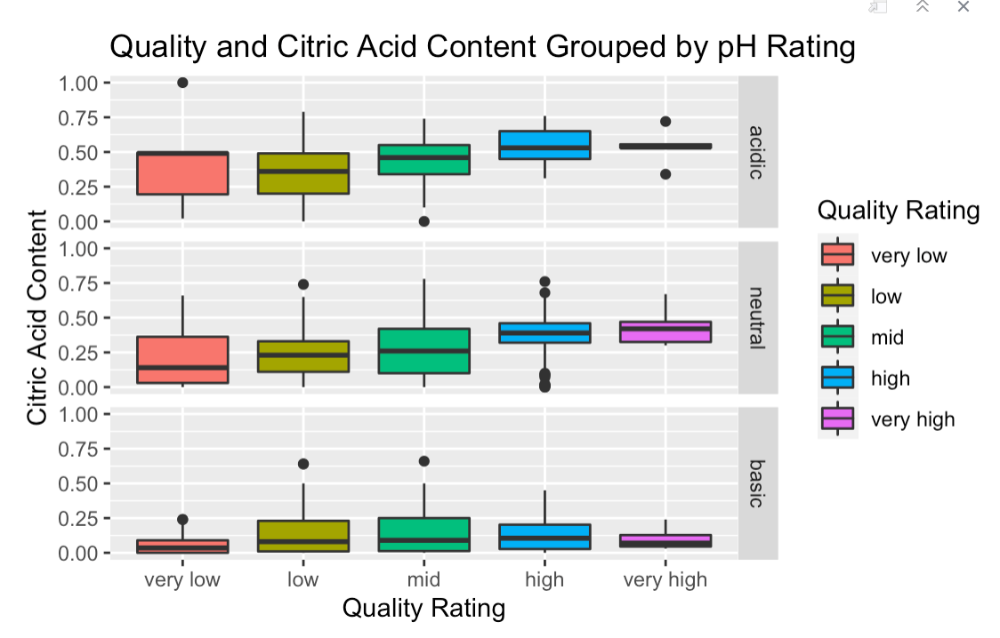
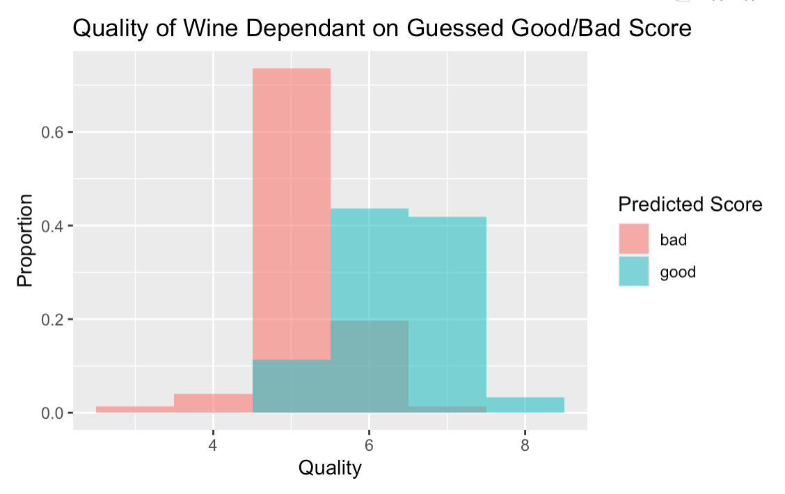

```{r setup, include=FALSE}
knitr::opts_chunk$set(echo = FALSE)
```


```{r, eval=FALSE}
data <- mydata<-read.csv("/Users/Noah/Desktop/winequality-red.csv", header=TRUE)
```

```{r, eval=FALSE}
library(ggplot2)
```


```{r, eval=FALSE}
quality_rating=cut(data$quality,breaks=c(0,4,5,6,7,10),labels=c("very low","low","mid","high","very high"))
```


```{r, eval=FALSE}
pH_rating=cut(data$pH,breaks=c(0,3.2,3.4,5),labels=c("acidic","neutral","basic"))
```

```{r, eval=FALSE}
data$pH_rating=pH_rating
data$quality_rating=quality_rating
```

The first visualization is a histogram that describes the spread of how the wines were scored on a 0-10 scale. It's important to note that there is not an equal spread of numeric scores or quality rating scores. Low had the most wines with mid following close behind. I combined the scores 3 and 4 into the very low category while the very high category is just wines that scored 8. This was the highest score given.

```{r, echo=FALSE}

```

```{r, eval=FALSE}
ggplot(data,aes(x=quality, y= ..count..))+
  geom_histogram(binwidth=1,aes(fill=quality_rating))+
  xlab("quality")+
  ylab("Count")+
  ggtitle("Histogram of Wine Quality")+
  labs(fill="Quality Rating")
```
Here's a histogram of alcohol contents to give a picture of its spread. It has a left skew, as most wines are 9-12 percent alcohol. While not the most complicated graph, it I did want to make note of this distribution. 

```{r, echo=FALSE}

```

```{r, eval=FALSE}
ggplot(data,aes(x=alcohol, y=..density..))+
  geom_histogram(binwidth=1,aes(fill=..count..))+
  ylab("Proportion")+
  ggtitle("Histogram of Alcohol Content")
```

This visualization gives a good overview of the spreads and correlations of each variable in the data set with quality score. It is an informative look at which chemical processes show correlation with quality scores, which is the ultimate question I am trying to answer in this analysis. Seeing the spreads is important as well- they are pretty wide which indicates that great wines and terrible wines share many charecteristics. On average, though, some of these variables do show coorelation with quality. 


```{r, echo=FALSE}

```

```{r, echo=FALSE}

```

```{r, eval=FALSE}
install.packages("gridExtra")
library(gridExtra)
```

```{r, warning=FALSE, eval=FALSE}
pg1=ggplot(data,aes(x=quality_rating,y=fixed.acidity))+
  geom_boxplot(aes(fill=quality_rating))+
  xlab("Quality Rating")+
  ylab("Fixed Acidity")+
  theme(legend.position="none")
pg2=ggplot(data,aes(x=quality_rating,y=volatile.acidity))+
  geom_boxplot(aes(fill=quality_rating))+
    xlab("Quality Rating")+
    ylab("Volatile Acidity")+
  theme(legend.position="none")
pg3=ggplot(data,aes(x=quality_rating,y=citric.acid))+
  geom_boxplot(aes(fill=quality_rating))+
    xlab("Quality Rating")+
    ylab("Citric Acid")+
  theme(legend.position="none")
pg4=ggplot(data,aes(x=quality_rating,y=residual.sugar))+
  geom_boxplot(aes(fill=quality_rating))+
  scale_y_continuous(limits=c(1,5))+
    xlab("Quality Rating")+
    ylab("Residual Sugar")+
  theme(legend.position="none")
pg5=ggplot(data,aes(x=quality_rating,y=chlorides))+
  geom_boxplot(aes(fill=quality_rating))+
    xlab("Quality Rating")+
    ylab("Chlorides")+
  theme(legend.position="none")
pg6=ggplot(data,aes(x=quality_rating,y=free.sulfur.dioxide))+
  geom_boxplot(aes(fill=quality_rating))+
    xlab("Quality Rating")+
    ylab("Free Sulfer Dioxide")+
  theme(legend.position="none")
pg7=ggplot(data,aes(x=quality_rating,y=total.sulfur.dioxide))+
  geom_boxplot(aes(fill=quality_rating))+
    xlab("Quality Rating")+
    ylab("Total Sulfer Dioxide")+
  theme(legend.position="none")
pg8=ggplot(data,aes(x=quality_rating,y=density))+
  geom_boxplot(aes(fill=quality_rating))+
    xlab("Quality Rating")+
    ylab("Density")+
  theme(legend.position="none")
pg9=ggplot(data,aes(x=quality_rating,y=pH))+
  geom_boxplot(aes(fill=quality_rating))+
    xlab("Quality Rating")+
    ylab("pH")+
  theme(legend.position="none")
pg10=ggplot(data,aes(x=quality_rating,y=sulphates))+
  geom_boxplot(aes(fill=quality_rating))+
  scale_y_continuous(limits=c(0.3,1.3))+
    xlab("Quality Rating")+
    ylab("Sulphates")+
  theme(legend.position="none")
pg11=ggplot(data,aes(x=quality_rating,y=alcohol))+
  geom_boxplot(aes(fill=quality_rating))+
    xlab("Quality Rating")+
    ylab("Alcohol Content")+
  theme(legend.position="none")

grid.arrange(
  pg1,
  pg2,
  pg3,
  pg4,
  nrow = 2,
  top = "Boxplots of Variables and Quality Rating"
  )

grid.arrange(
  pg8,
  pg9,
  pg10,
  pg11,
  nrow = 2,
  top = "Boxplots of Variables and Quality Rating"
  )
```

Next, we break down these correlations more qualitatively to examine them further. I used pearson correlations do determine r values with respect to quality. A high score means a strong correlation, while one closer to zero implies no correlation. A negative correlation means when the variable increases the quality score decreases. Interestingly, residual sugar is one of the worst indicators of good wine. Things like sulfates, alcohol content, and volatile acidity are relatively strong predictors. 

```{r, echo=FALSE}

```

```{r, eval=FALSE}
df <- data.frame (var  = c("fixed.acidity","volatile.acidity","citric.acid","residual.sugar","chlorides", "free.sulfur.dioxide", "total.sulfur.dioxide", "density", "pH", "sulphates", "alcohol"),
                  coor = c(0.124,-0.39,0.226,0.0137,-.129,-0.05,-0.185,-0.175,-0.05,.25,.476))

df$coor_type <- ifelse(df$coor < 0, "Negative", "Positive")
```

```{r, eval=FALSE}
ggplot(df, aes(x =reorder(var, coor), y = coor, fill=coor_type)) +
  geom_bar(stat = "identity")+
  xlab("Group")+
  ylab("Value")+
    coord_flip()+
  labs(fill="Coorelation Type")+
  ggtitle("Coorelation to Wine Quality")+
  xlab("Variable")+
  ylab("Coorelation")
```


```{r, eval=FALSE}
install.packages("viridis")
library(viridis)
```

It's helpful to see some correlation within the variables themselves. Two that have especially high correlation are density and alcohol content. Both of these have correlation with quality as well. The graph below shows both of these things. The fit line shows the relationship between wine density and alcohol content, and the color of the points get lighter as they move right to higher alcohol content and lower densities. This represents an increase in quality.


```{r, echo=FALSE}

```

```{r, eval=FALSE}
pt=ggplot(data, aes(x=alcohol,y=density)) + 
  geom_point(aes(colour=quality),alpha=1)+
  geom_smooth(method="loess")

pt+scale_color_viridis(option="plasma")
```

Citric acid and pH also are related. This facet grid shows a number of things about these two variables and quality. The citric acid content increases with moves from basic to neutral to acidic pH. Acidic and neutral wines generally increase get higher ratings with higher citric acid content, while the basic wines are about the same with citric acid content. This implies that if a wine is going to be acidic or neutral, this acidity should come from citric acid instead of another source which could result in the acidity coming in a harsher form.

```{r, echo=FALSE}

```

```{r, eval=FALSE}
bp = ggplot(data, aes(x=quality_rating, y=citric.acid, group=quality_rating)) +
  geom_boxplot(aes(fill=quality_rating))+
    xlab("Quality Rating")+
    ylab("Citric Acid Content")

bp + facet_grid(rows = vars(pH_rating))+ggtitle("Quality and Citric Acid Content Grouped by pH Rating") +  labs(fill='Quality Rating')
```
```{r, echo=FALSE, eval=FALSE}
cor(data$alcohol,data$quality, method="pearson")
```

```{r, echo=FALSE, eval=FALSE}
df <- data.frame (var  = c("fixed.acidity","volatile.acidity","citric.acid","residual.sugar","chlorides", "free.sulfur.dioxide", "total.sulfur.dioxide", "density", "pH", "sulphates", "alcohol"),
                  coor = c(0.124,-0.39,0.226,0.0137,-.129,-0.05,-0.185,-0.175,-0.05,.25,.476))

df$coor_type <- ifelse(df$coor < 0, "Negative", "Positive")
```

```{r, echo=FALSE, eval=FALSE}
data$goodbad=NULL
```


```{r, echo=FALSE, eval=FALSE}
data[data$volatile.acidity<quantile(data$volatile.acidity)[3] & data$fixed.acidity>quantile(data$fixed.acidity)[3] & data$citric.acid>quantile(data$citric.acid)[3] & data$alcohol>quantile(data$alcohol)[3] & data$sulphates>quantile(data$sulphates)[3],"goodbad"]="good"

data[data$volatile.acidity>quantile(data$volatile.acidity)[3] & data$fixed.acidity<quantile(data$fixed.acidity)[3] & data$citric.acid<quantile(data$citric.acid)[3] & data$alcohol<quantile(data$alcohol)[3] & data$sulphates<quantile(data$sulphates)[3],"goodbad"]="bad"

data
```
```{r, echo=FALSE, eval=FALSE}
new.df <- na.omit(data)
```

This visualization is where I make predictions about what makes good and bad wines and test this hypothesis. Based on my visualizations, I guessed that the best wines would have low volatile acidity, high fixed acidity, high citric acid content, high alcohol content, and high sulfate content. If a wine was above or below the 50th percentile each these variables (depending on if I thought the better wines would have a high or low concentration)they would be marked as "good" or "bad". The wines that were marked good and bad needed to be in the right percentile for each of the mentioned variables. The graph below shows that I was right in my predictions. The "good" wines fell higher in quality while the "bad" wines had lower quality. 

```{r, echo=FALSE}

```

```{r, eval=FALSE}
ggplot(new.df, aes(x = quality, y=..density.., fill = goodbad, na.rm=TRUE)) +
  geom_histogram(binwidth=1,position = "identity", alpha = .6)+
  ylab("Proportion")+
  xlab("Quality")+
  ggtitle("Quality of Wine Dependant on Guessed Good/Bad Score")+
  labs(fill="Predicted Score")
```

